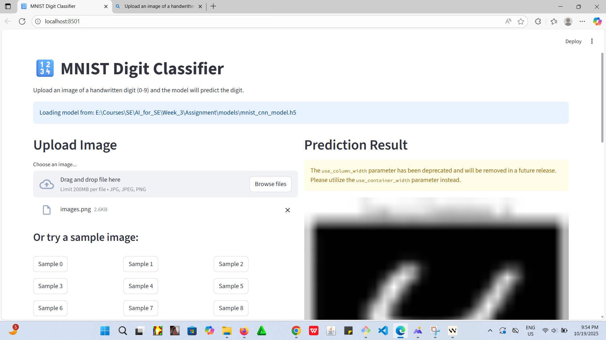
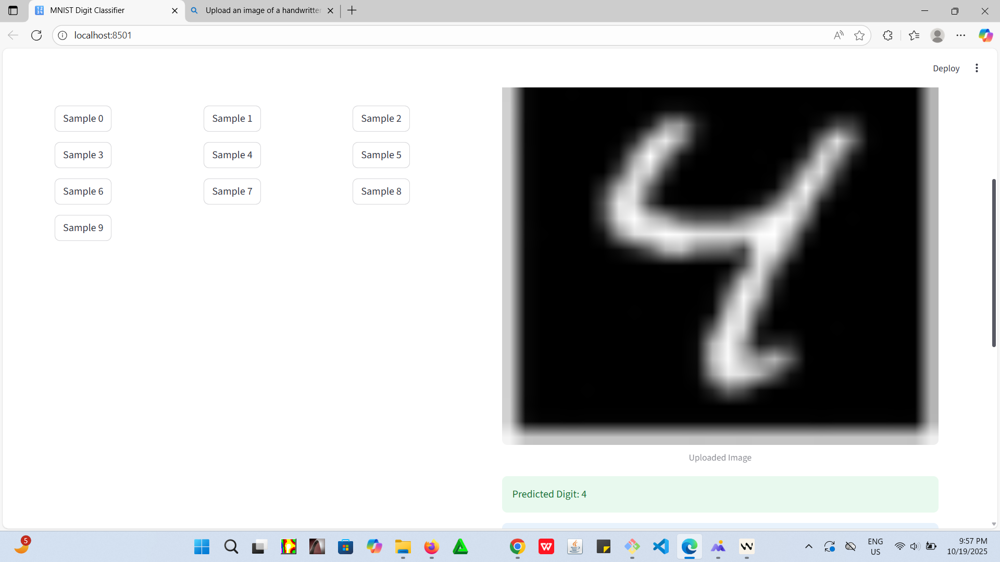
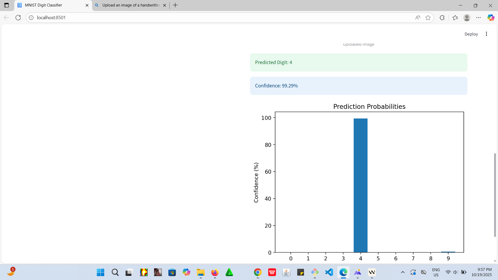

# AI Tools and Applications Assignment

**Author:** Chernet Getaneh  
**Email:** [chernetg@gmail.com](mailto:chernetg@gmail.com)  
**GitHub:** [Cherg906](https://github.com/Cherg906)  
**Repository:** [Wk3_AI_Tools_and_Applications_Assignment](https://github.com/Cherg906/Wk3_AI_Tools_and_Applications_Assignment.git)

This repository contains the implementation of various AI tools and frameworks as part of the "Mastering the AI Toolkit" assignment, including a CNN-based MNIST digit classifier, Iris classification, and NLP analysis tasks.

## 🚀 Features

- **MNIST Digit Classification**: CNN model for handwritten digit recognition
- **Iris Classification**: Machine learning model for flower species classification
- **NLP Analysis**: Text processing and sentiment analysis
- **Web Interface**: Streamlit-based web application for model interaction
- **Comprehensive Reporting**: Detailed analysis and visualization of model performance

## 🛠️ Project Structure

```
AI_Tools_Assignment/
├── data/                    # Datasets used in the project
├── models/                  # Trained model files
├── notebooks/               # Python scripts for each task
│   ├── part1_theory.py      # Theoretical concepts and explanations
│   ├── part2_task1_iris_classification.py
│   ├── part2_task2_mnist_cnn.py
│   └── part2_task3_nlp_analysis.py
├── reports/                 # Generated reports and visualizations
├── src/                     # Source code and utility functions
├── web_app/                 # Web application code (Bonus task)
├── app.py                   # Main Streamlit application
├── generate_report.py       # Script to generate project report
├── requirements.txt         # Project dependencies
└── README.md                # This file
```

## 🚀 Setup and Installation

1. **Clone the repository**:
   ```bash
   git clone https://github.com/Cherg906/Wk3_AI_Tools_and_Applications_Assignment.git
   cd Wk3_AI_Tools_and_Applications_Assignment
   ```

2. **Create and activate a virtual environment** (recommended):
   ```bash
   python -m venv venv
   source venv/bin/activate  # On Windows: .\venv\Scripts\activate
   ```

3. **Install dependencies**:
   ```bash
   pip install -r requirements.txt
   ```

## 🏃‍♂️ Running the Application

To run the Streamlit web application:
```bash
streamlit run app.py
```

## 📝 License

This project is licensed under the MIT License - see the [LICENSE](LICENSE) file for details.

## 📧 Contact

For any questions or suggestions, please contact [Chernet Getaneh](mailto:chernetg@gmail.com).

2. Create and activate a virtual environment:
   ```bash
   python -m venv venv
   .\venv\Scripts\activate  # On Windows
   source venv/bin/activate  # On macOS/Linux
   ```

3. Install dependencies:
   ```bash
   pip install -r requirements.txt
   python -m spacy download en_core_web_sm
   ```

## Running the Scripts

### Task 1: Iris Classification
```bash
cd notebooks
python part2_task1_iris_classification.py
```

### Task 2: MNIST Digit Classification
```bash
cd notebooks
python part2_task2_mnist_cnn.py
```

### Task 3: NLP Analysis
```bash
cd notebooks
python part2_task3_nlp_analysis.py
```

### Part 1: Theoretical Questions
```bash
cd notebooks
python part1_theory.py
```

## Tasks

### Part 1: Theoretical Understanding
- Answers to theoretical questions about AI tools and frameworks.

### Part 2: Practical Implementation
1. **Iris Classification with Scikit-learn**
   - Data preprocessing
   - Decision tree classifier
   - Model evaluation

2. **MNIST Digit Classification with CNN**
   - CNN model implementation
   - Training and evaluation
   - Prediction visualization

3. **NLP Analysis with spaCy**
   - Named Entity Recognition (NER)
   - Sentiment analysis

### Part 3: Ethics & Optimization
- Ethical considerations
- Code debugging challenge

### Bonus Task
- Web application deployment using Streamlit/Flask

### Deployment
link: https://handwrittendigitidentifier.streamlit.app/
Screenshoot of the deployed app:



## Contributors
- [Chernet Getaneh](https://github.com/Cherg906)

## License
This project is licensed under the MIT License - see the [LICENSE](LICENSE) file for details.
